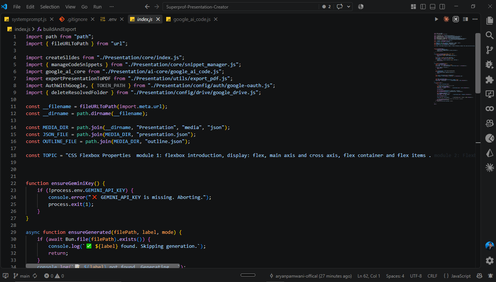
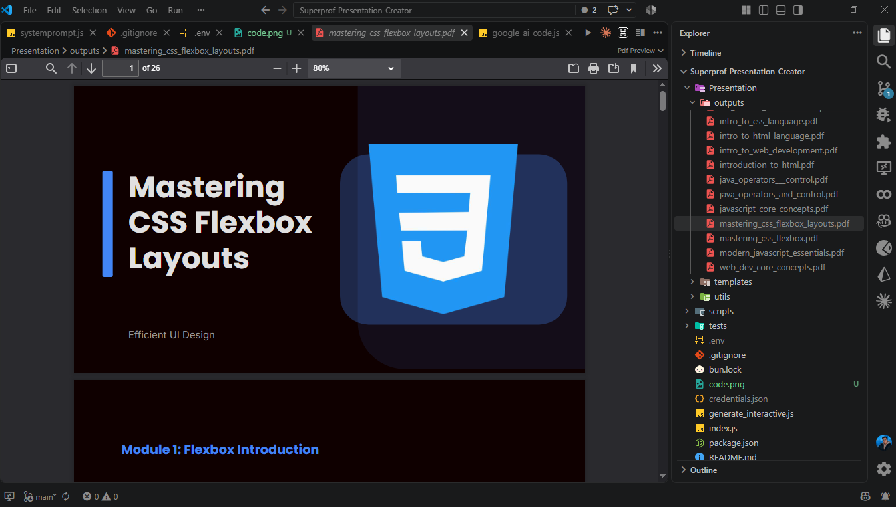
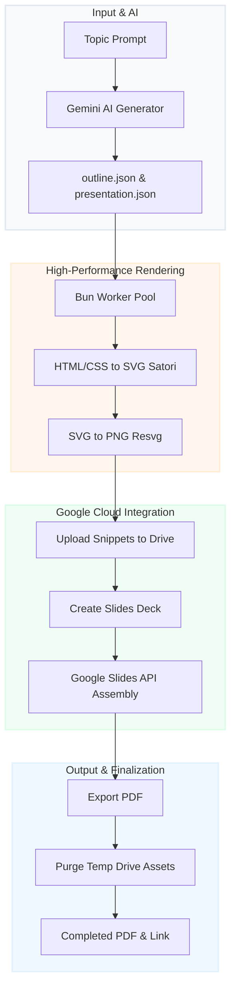

# 🎥 Aryan's Presentation Creator
> **Transform text prompts into stunning, ready-to-present Google Slides decks with automatic code screenshots.**

[](https://bun.sh/)
[](https://www.typescriptlang.org/)
[](https://deepmind.google/technologies/gemini/)
[](#)
[](#)

Aryan's Presentation Creator is an automated, high-performance CLI pipeline written in **TypeScript** and powered by **Bun**, **Gemini AI**, and the **Google Workspace APIs**. It takes a single topic, generates structured presentation modules, captures beautifully formatted syntax-highlighted code blocks, uploads assets to Drive, constructs the presentation, exports to PDF, and performs automatic cleanup.

---

## 📸 Preview

### Code Generation & Interactive Slide Previews
| Code Output (`code.png`) | Generated Google Slides Preview (`output.png`) |
| :---: | :---: |
|  |  |

---

## ✨ Features

*   **🛡️ Type-Safe Architecture** — Built with strictly typed models, custom type guards, and compile-time verification to prevent data-structure inconsistencies and API model mismatches.
*   **🤖 AI-Powered Content Synthesis** — Uses the official `@google/genai` SDK and `gemini-2.5-flash` to craft educational course outlines and detailed content slides.
*   **🎨 Syntax-Highlighted Screenshots** — Automatically parses markdown code blocks and renders them into high-res syntax-highlighted code editor images via **Satori** and **Resvg**.
*   **⚡ Multi-Threaded Rendering** — Utilizes native **Bun Workers** to compile HTML/CSS snippets into PNGs concurrently, scaling with your CPU cores.
*   **🔑 Fully Automated OAuth2 Flow** — Automatically spins up a temporary background server on port `8080` to intercept and complete the Google login redirect. No manual copy-pasting of authorization codes required.
*   **📄 Automated PDF Export** — Downloads a high-quality PDF version of the presentation directly to your local computer.
*   **🧹 Cloud Storage Cleanup** — Temporarily uploads screenshot assets to Google Drive for slide compilation and automatically purges the files once done, keeping your Drive clean.

---

## ⚙️ Architecture



---

## 🚀 Getting Started

### Prerequisites
1.  Install the **[Bun Runtime](https://bun.sh/)**.
2.  Enable the **Google Slides** and **Google Drive** APIs in your [Google Cloud Console](https://console.cloud.google.com/).
3.  Configure your OAuth Consent Screen, generate an **OAuth 2.0 Web Client**, download the JSON file, rename it to `credentials.json`, and place it in the project root.

### Installation
Clone the repository and install all dependencies:
```bash
git clone https://github.com/aryanpamwani-offical/Aryan-Presentation-Creator.git
cd Aryan-Presentation-Creator
bun install
```

### Environment Setup
Create a `.env` file in the root folder:
```env
GEMINI_API_KEY=your_gemini_api_key_here
GOOGLE_MODEL=gemini-2.5-flash
```

---

## 💻 Usage

To run the full presentation generation pipeline, start the main entry point:
```bash
bun index.ts [options] ["Your Topic Name"]
```

### ⚙️ Options & Flags:
*   **Positional Argument** (`"Topic Name"`) — Runs the pipeline directly for a custom topic (e.g. `bun index.ts "Operators in Java"`). If omitted, falls back to the default topic.
*   **`-i` / `--interactive`** — Prompts you to enter or paste a custom topic name directly in the terminal console.
*   **`-gi` / `--generate-interactive`** — Prompts you to interactively configure the code snippet styling options (Theme, Font, and Transparent Background).
*   **`--force`** — Forces a complete rebuild of the topic's presentation and outline (ignores and overwrites the outline and presentation caches).

### 🚀 Package Script Shortcuts:
You can also run commands using standard package scripts:
*   `bun run start` — Runs the main presentation pipeline.
*   `bun run interactive` — Runs pipeline with interactive topic input (`bun index.ts -i`).
*   `bun run snippet-customizer` — Runs pipeline with interactive snippet customization (`bun index.ts -gi`).
*   `bun run interactive-all` — Runs pipeline prompting for both topic and snippet styles (`bun index.ts -i -gi`).
*   `bun run generate-snippets` — Compiles code snippets locally with custom styles (`bun generate_interactive.ts`).
*   `bun run download-logos` — Downloads programming logos (`bun run scripts/download_logos.js`).
*   `bun run type-check` — Performs strict type safety analysis (`bun x tsc --noEmit`).

### 🔑 Authentication:
If it's your first time running, your web browser will automatically open to authenticate with Google. Grant permissions and the script will automatically capture the token and continue.

---

## 🛠️ Built With

*   **Runtime:** [Bun](https://bun.sh/) (Native file I/O, Workers, and Server APIs)
*   **Language:** [TypeScript](https://www.typescriptlang.org/) (Strict structural type definitions)
*   **AI Engine:** [@google/genai](https://www.npmjs.com/package/@google/genai) (Official Google Gemini SDK)
*   **APIs:** [googleapis](https://www.npmjs.com/package/googleapis) (Google Drive & Google Slides)
*   **Graphics:** [Satori](https://github.com/vercel/satori) & [Resvg](https://github.com/yisibl/resvg-js) (Fast SVG compilation & PNG rendering)
*   **CSS Engine:** [Tailwind CSS](https://tailwindcss.com/) (For styling code screenshots)

---

## 📁 Directory Structure

```text
Aryan-Presentation-Creator/
├── Presentation/
│   ├── ai-core/             # Gemini API interfaces (.ts)
│   ├── config/              # Google Auth & styling configurations (.ts)
│   ├── core/                # Layout components & presentation compilers (.ts)
│   ├── media/               # Caches & temporary local images (.json)
│   ├── templates/           # Styling templates & Tailwind config (.html / .css)
│   └── utils/               # PDF exporters & multi-threaded workers (.ts)
├── scripts/                 # Asset builders & maintenance utilities (.js)
├── credentials.json         # Google OAuth Credentials (gitignore)
├── token.json               # Cached user session (gitignore)
├── generate_interactive.ts   # Interactive local screenshot compiler (.ts)
├── index.ts                  # App Entry point (.ts)
└── README.md                # Documentation
```

---

## 📜 License
Licensed under the [ISC License](LICENSE).
