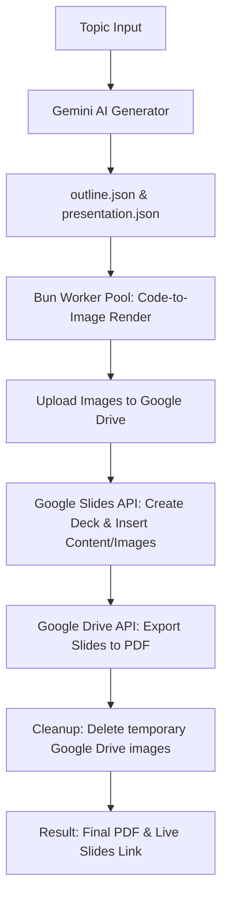

# Aryan's Presentation Creator 🚀

An automated, high-performance pipeline powered by **Bun**, **Gemini AI**, and the **Google Workspace APIs** to generate beautiful, interactive Google Slides presentations from a single topic prompt, complete with syntax-highlighted code block screenshots.

---

## Features

- 🤖 **AI-Generated Outlines & Content**: Leverages the official `@google/genai` SDK to draft structured, multi-module outlines and detailed slide content based on a target topic.
- 🎨 **Syntax-Highlighted Code Screenshots**: Automatically extracts code blocks from the presentation details and renders them into high-resolution, syntax-highlighted images using **Satori** and **Resvg** styled with custom Tailwind themes.
- ⚡ **Multi-Threaded Worker Pool**: Offloads CPU-bound screenshot rendering onto a pool of **native Bun Workers** sized dynamically to your CPU cores.
- ☁️ **Google Drive & Slides Integration**: 
  - Creates a new Google Slides deck instantly.
  - Automatically uploads generated code screenshots to a temporary, public Google Drive folder so Google Slides can reference them.
  - Cleans up the temporary Drive folder upon pipeline completion.
- 📄 **One-Click PDF Export**: Exports the finished presentation to a high-quality PDF file and downloads it locally.
- 🔑 **Simple OAuth Integration**: Seamlessly authenticates with Google OAuth using a simple CLI prompt and caches the authentication tokens locally for subsequent runs.

---

## Architecture Diagram



---

## Getting Started

### Prerequisites

- **Bun**: Make sure [Bun](https://bun.sh/) is installed.
- **Google Cloud Console Project**:
  - Enable **Google Slides API** and **Google Drive API**.
  - Configure the OAuth Consent Screen and download your `credentials.json` (OAuth Client Credentials).
  - Place `credentials.json` in the root folder of this project.

### Installation

Clone the repository and install the dependencies:

```bash
bun install
```

### Environment Setup

Create a `.env` file in the root directory and add your Gemini API Key and Model configuration:

```env
GEMINI_API_KEY=your_gemini_api_key_here
GOOGLE_MODEL=gemini-2.5-flash
```

---

## How to Run

1. Open [`index.js`](file:///C:/Users/DELL/Desktop/Superprof-Presentation-Creator/index.js) and modify the `TOPIC` constant at the top of the file to your desired presentation topic.
2. Run the pipeline:

```bash
bun index.js
```

### What happens behind the scenes:
- On your first run, a Google authentication link will print to the console. Visit the link, grant permissions, copy the auth code, and paste it back into the terminal. A `token.json` file will be saved for future automatic logins.
- The pipeline will generate the presentation files, render screenshots, build slides on Google Drive, download the PDF, and automatically clean up after itself.

---

## Project Structure

- **`index.js`**: The main execution script coordinating the auth, generation, compilation, and export tasks.
- **`Presentation/ai-core/`**: Core modules for communicating with Gemini AI and saving data structure outputs.
- **`Presentation/config/`**: Google Auth helper modules and snippet-rendering configurations.
- **`Presentation/core/`**: Google Slides builder scripts and layout configs (concept slides, code slides, etc.).
- **`Presentation/media/`**: Local cache directory for structural JSON, local logos, and code screenshot storage.
- **`Presentation/utils/`**: Helper files for PDF exports, retry mechanisms, image resizing, and the Bun Worker Pool orchestration.
- **`scripts/`**: Utility scripts for downloading Tailwind CSS, caching logos, downloading fonts, and performing manual cleanups on your Google Drive.

---

## Utility Scripts

The project includes several CLI scripts to facilitate setup and maintenance:

- **Download Tailwind CSS**:
  ```bash
  bun run scripts/download_tailwind.js
  ```
- **Download Custom JetBrains Mono Font**:
  ```bash
  bun run scripts/download_font.js
  ```
- **Prune/Clean Google Drive Root Folder**:
  ```bash
  bun run scripts/cleanup_drive_root.js
  ```

---

## License

This project is licensed under the ISC License.
